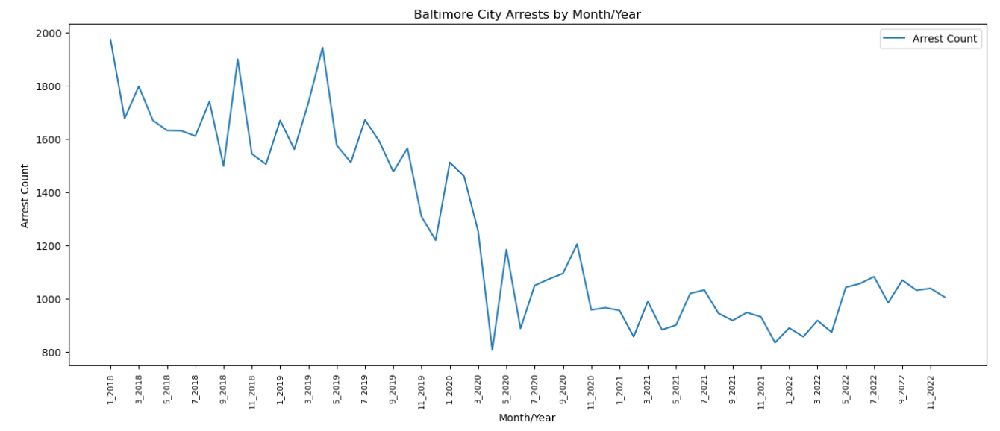
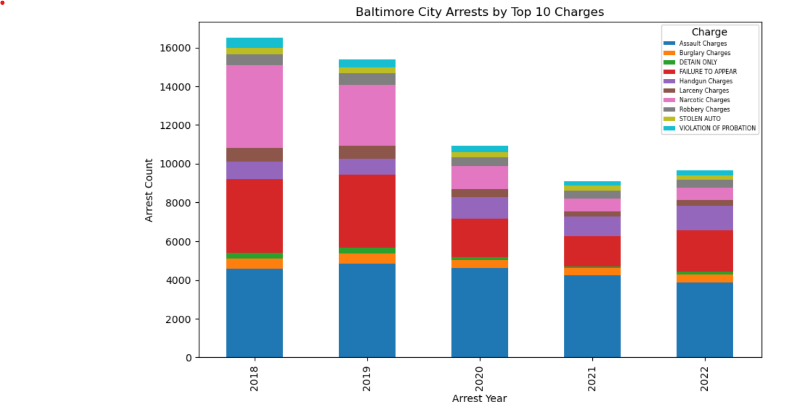
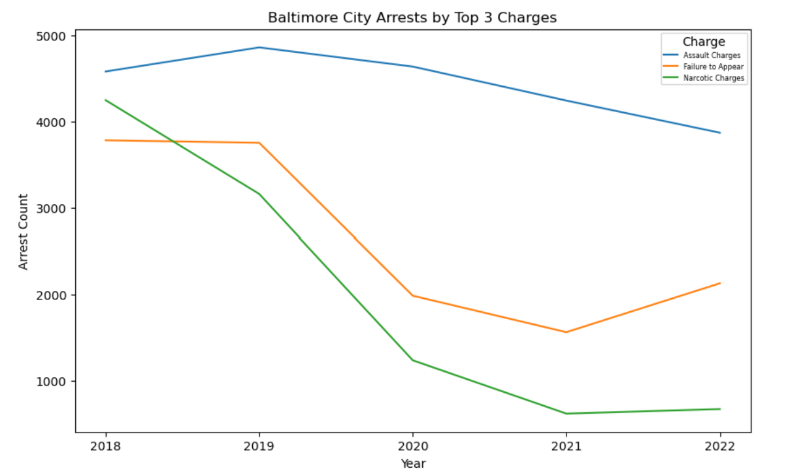
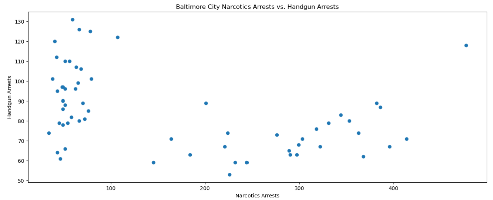
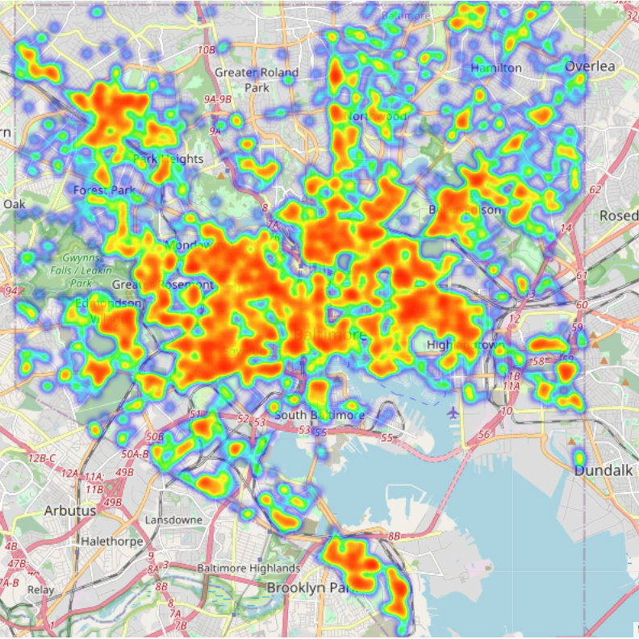
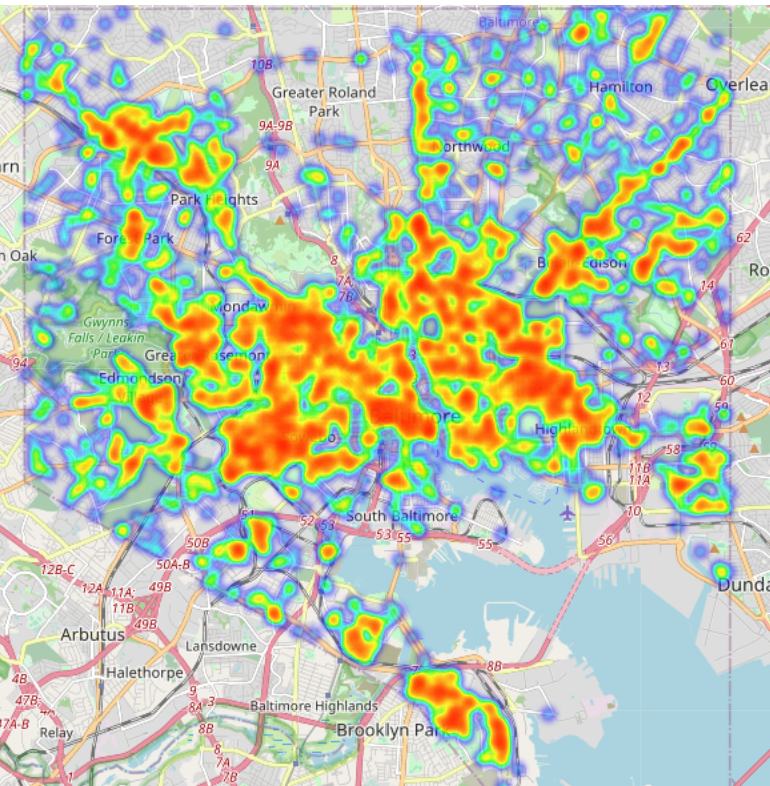
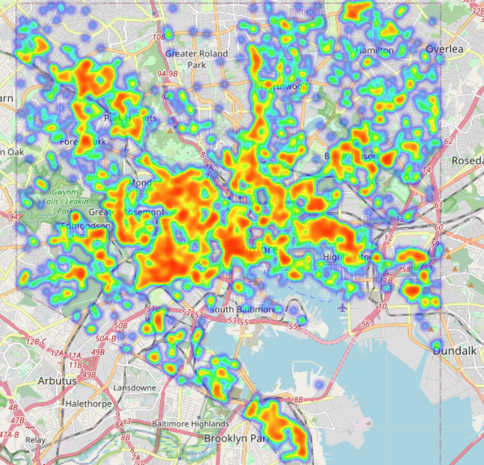
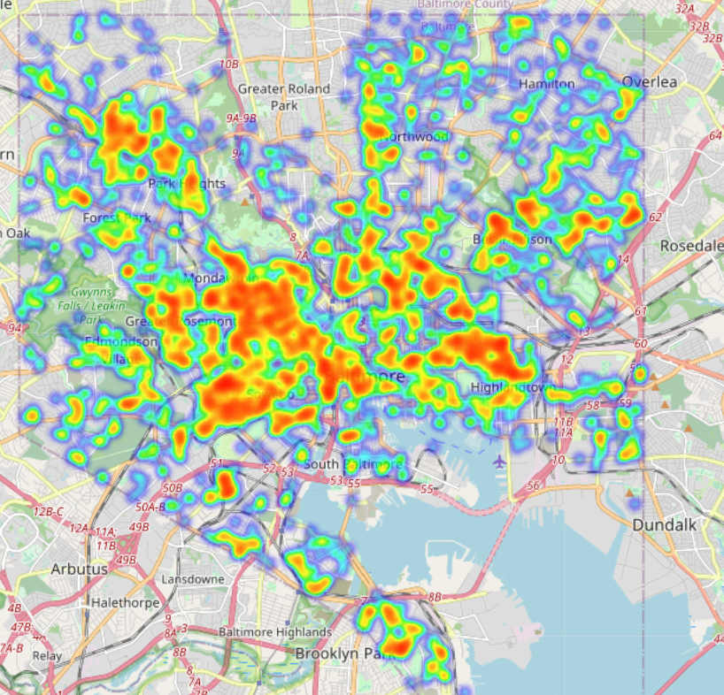
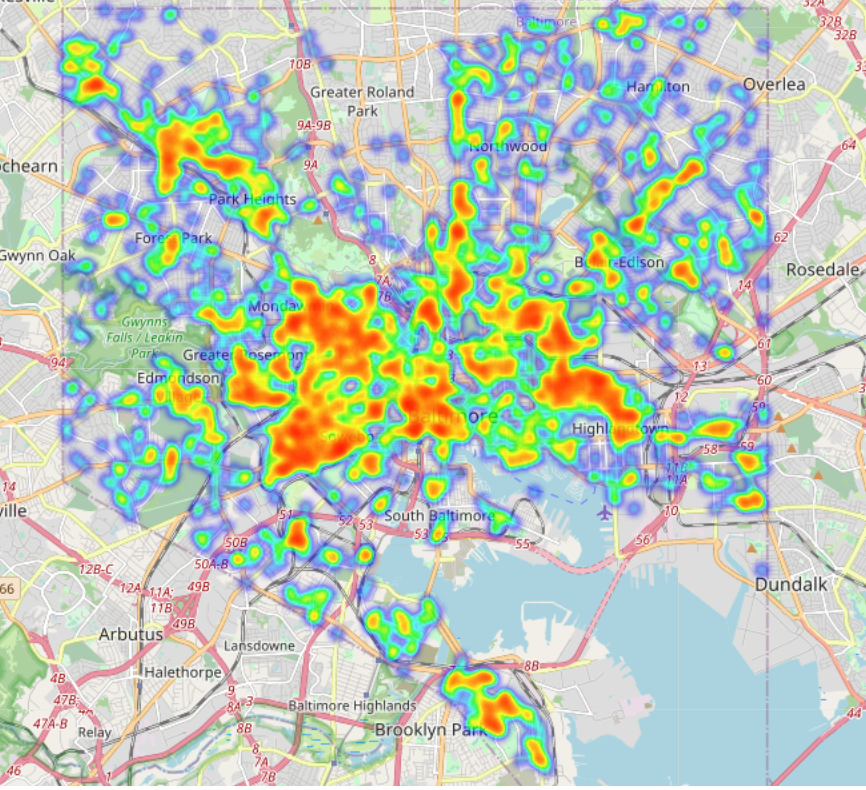

# The Pandemic’s Effect on Arrests in Baltimore City.

---

## Project Description

**Description:** Our hypothesis is that COVID may have resulted in the decrease of arrest numbers in Baltimore City. We are examining Baltimore City’s arrest data compiled by the police department in 2018 through 2022. We had three questions to answer at the end of the project and these are: (i) did covid impact overall arrests for the city of Baltimore? (ii)did covid impact the types of charges differently? (iii) did covid change the geography of arrest locations?(comparing during and after covid)

---

## Directory
1. [Project Description](#Project-Description)
2. [Setup](#Setup)
3. [Dependencies](#Dependencies)
4. [Input file](#Input-file)
5. [Jupyter Notebook files](#Jupyter-Notebook-files)
6. [Charts and Maps files](#Charts-and-Maps-files)
7. [Analysis Presentation file](#Analysis-Presentation-file)
8. [Data Prep and Analysis Steps](#Data-Prep-and-Analysis-Steps)
9. [Findings and Conclusions](#Findings-and-Conclusions)
10. [Limitations and Recommendations](#Limitations-and-Recommendations)
11. [References](#References)
---

## Setup: 
- Imported the dataset containing Baltimore Police Department arrest records.
- Cleaned and prepared the data by focusing on arrests in 2018-2022, grouping like arrests, focusing on top 10 types of arrest charges, and removing "unknown" arrest charge types.
- Conducted exploratory data analysis to gain insight into trends, distributions, and patterns of arrest charges across 2018-2022. 
- Compared the prevalence of certain types of arrests across the city of Baltimore for 2018-2022.

---

## Dependencies 
  
    import numpy as np
    import pandas as pd
    import pytz

    import os 
    from scipy import stats
    import matplotlib.pyplot as plt
    import matplotlib.dates as mdates
    import re
    import hvplot
    from scipy.stats import linregress

    import matplotlib.pyplot as plt
    from matplotlib.ticker import FormatStrFormatter
    import warnings
    warnings.filterwarnings("ignore")

---

## Input file

- data/BDP_Arrest.csv - dataset representing arrests made by the Baltimore Police Department from January 1, 2010 through March 12, 2023.

---

## Jupyter Notebook files

- dataProject1.ipnb - final script that conducted the data cleansing and prep steps, the exploratory analysis and generated the analysis charts.
- maps.ipnb - final script that generated the maps for 2018-2022.

---

## Charts and Map files

- Arrests_by_month_year.png; time series graph of total arrests 2018-2022
- Baltimore_City_arrests_by_month.png; 5 line graphs of total arrests for each year 2018-2022
- stacked_bar_chart_offenses.png; stacked bar graph by year for types of arrest charges
- top_3_charges_2018-2022.png; line graph per year for the top 3 arrest charges
- Baltimore_City_arrests.spots4to10.png; line graph per year for the next 7 arrest charges
- Narcotics_vs_handgun_arrests.png; scatterplot of narcotics vs. handgun arrest charges
- 2018_heatmap.png; Baltimore City heatmap of total arrest charges in 2018
- 2019_heatmap.png; Baltimore City heatmap of total arrest charges in 2019
- 2020_heatmap.png; Baltimore City heatmap of total arrest charges in 2020
- 2021_heatmap.png; Baltimore City heatmap of total arrest charges in 2021
- 2022_heatmap.png; Baltimore City heatmap of total arrest charges in 2022

---

## Analysis Presentation file

- Project 1-Baltimore City Arrests (June 5th, 2023)_Final.pptx

---

## Data Prep and Analysis Steps

- Loaded the CSV file located on BPD website into a Pandas DataFrame and displayed data.

- Defined the desired time frame, 1/1/2018-12/31/2022.

- Converted date values to EST timezone and filtered the data based on the time frame.

- Applied the filter to get the narrowed down data to extract month and year from the arrestdatetime column.

- Isolated the 2018 data for mapping to define latitutde and longitude and remove the nulls
  
- Created a map to combine latitudes and longitudes into list. Displayed the map.

- Isolated the 2019 data for mapping to define latitutde and longitude and remove the nulls.
  
- Created a map to combine latitudes and longitudes into list. Displayed the map.

- Isolated the 2020 data for mapping to define latitutde and longitude and remove the nulls.
 
- Created a map to combine latitudes and longitudes into list. Displayed the map.

- Isolated the 2021 data for mapping to define latitutde and longitude and remove the nulls.
  
- Created a map to combine latitudes and longitudes into list. Displayed the map.

- Isolated the 2022 data for mapping to define latitutde and longitude and remove the nulls.

- Created a map to combine latitudes and longitudes into list. Displayed the map.

---

## Findings

**Arrests by month per year**

- Number of arrests drops drastically in March 2020, with a visible trend shift prior and after March 2020.
- The sharp peak after the COVID lockdown was likely due to people turning themselves in to not face jail time due to COVID restrictions with incarcerations.

**Stacked bar chart offenses**

- Number of “Assault” charges remained consistent across the 5 years.  "Assault" Charges likely didn’t see much of a change as most people were home without the ability to get time away and were dealing with stressors such as financial strain, concerns about the virus, and overall uncertainty.  This likely led to domestic disputes and assualts.
- Number of “Failure to Appear” and “Larceny” charges decreased starting in 2020.  "Failure to Appear" arrests likely saw a decline as these were often the result of officers being proactive and serving warrants as well as officers conducting traffic stops and encountering citizens in public.  Police Departments were stressing the decrease of face-to-face interactions except for emergencies.  "Larceny" decreased as stores were closed so shoplifting wasn’t occurring (and again, people were not out and about to have their property stolen).
- Largest drop occurred within “Narcotic” charges starting in 2020.  "Narcotic" charges are often proactive.  Units conducting undercover operations may have been assigned to other capacities at the height of COVID and the emphasis on drugs likely shifted.  "Narcotic" arrests also stem from traffic stops, which were likely only conducted for serious violations, and other street interactions, which again, were likely halted due to concerns of spreading COVID.
- “Handgun” charges increased starting in 2020. It is unclear why "Handgun" charges increased (handgun charges are going to be concealing a handgun without a permit, possessing a handgun while being a convicted felon, carrying a weapon at prohibited locations (ie. School zones, airports. Etc)), and possessing a handgun while trafficking drugs.

**Top 3 charges 2018-2022**

- The top 3 occurring arrests were “Assault”, “Failure to Appear” and “Narcotic” charges.
- Arrests for “Narcotic” and “Failure to Appear” charges had the steepest declines in 2020.

**Baltimore city arrests spots4to10**

- All types of arrests decreased in 2020 except for “Handgun” charges which continued to have an increasing trend.

**Narcotics vs handgun arrests**

- We decided to look at the correlation between handgun violations and narcotic violations because when officers are stopping subjects, they are looking for weapons and they are looking for drugs.  Also, possessing a handgun while trafficking narcotics results in both handgun and narcotic arrests.  Therefore, we expected that there would be a positive linear relationship between Narcotics and Handgun arrests; however, we see that if we analyzed the relationship between Narcotics and Handguns across all 5 years (2018-2022), there is a slightly negative linear relationship with r=-0.404.  
- Examining the graph, we can see that there are 2 types of relationships occurring; the left of the line demonstrates the relationship in post Pandemic (2020-2022) and on the right a different relationship in pre-Pandemic years (2018-2019).  We recommend creating 2 scatterplots to further examine the relationship between Narcotics and Handgun arrests.

**2018 heatmap**

**2019 heatmap**

**2020 heatmap**

**2021 heatmap**

**2022 heatmap**

---

## Conclusion and Recommendations

