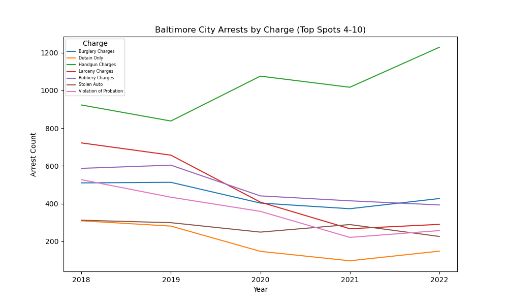

# The Pandemic’s Effect on Arrests in Baltimore City.

---

## Project Description

**Description:** Our hypothesis is that COVID may have resulted in the decrease of arrest numbers in Baltimore City. We are examining Baltimore City’s arrest data compiled by the police department in 2018 through 2022. We had three questions to answer at the end of the project and these are: (i) did covid impact overall arrests for the city of Baltimore? (ii)did covid impact the type of charges? (iii) did covid change the geography of arrest locations?(comparing during and after covid)

---

## Directory
1. [Project Description](#Project-Description)
2. [Setup](#Setup)
3. [Dependencies](#Dependencies)
4. [Data Prep and Analysis Steps](#Data Prep and Analysis Steps)
5. [Findings](#Findings)
6. [Conclusion and Recommendations](#Conclusion and Recommendations)

---

## Setup: 
- Import the dataset containing Baltimore Police Department arrest records
- Clean and prepare the data by removing duplicates, missing values, and outliers 
- Conduct exploratory data analysis to gain insight into trends, distributions and patterns 
- Group the arrest records according to their charge codes and investigate the distribution of charges throughout the year 
- Compare the prevalence of certain types of arrests

---

## Dependencies 

  
    import numpy as np
    import pandas as pd
    import pytz

    import os 
    from scipy import stats
    import matplotlib.pyplot as plt
    import matplotlib.dates as mdates
    import re
    import hvplot
    from scipy.stats import linregress

    import matplotlib.pyplot as plt
    from matplotlib.ticker import FormatStrFormatter
    import warnings
    warnings.filterwarnings("ignore")

---

## Data Prep and Analysis Steps

- Load the CSV file located on BPD website into a Pandas DataFrame and display data

- Define the desired time frame

- Convert date values to EST timezone and filter the data based on the time frame

- Apply the filter to get the narrowed down data to extract month and year from the arrestdatetime column

- Isolate the 2018 data for mapping to define latitutde and longitude and remove the nulls
  
- Create a map to combine latitudes and longitudes into list. Display the map

- Isolate the 2019 data for mapping to define latitutde and longitude and remove the nulls
  
- Create a map to combine latitudes and longitudes into list. Display the map

- Isolate the 2020 data for mapping to define latitutde and longitude and remove the nulls
 
- Create a map to combine latitudes and longitudes into list. Display the map

- Isolate the 2021 data for mapping to define latitutde and longitude and remove the nulls
  
- Create a map to combine latitudes and longitudes into list. Display the map

- Isolate the 2022 data for mapping to define latitutde and longitude and remove the nulls

- Create a map to combine latitudes and longitudes into list. Display the map

---

## Findings

**2018 heatmap**

**Arrests by month per year**

**Baltimore city arrests by month**

**Baltimore city arrests spots4to10**

**Narcotics vs handgun arrests**

**Stacked bar chart offenses**

**Top 3 charges 2018-2022**

---

## Conclusion and Recommendations

